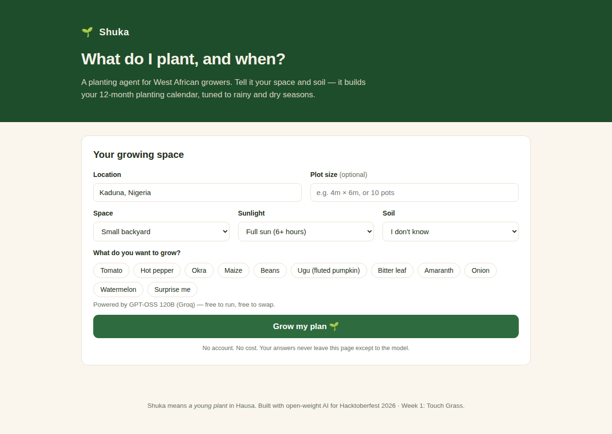
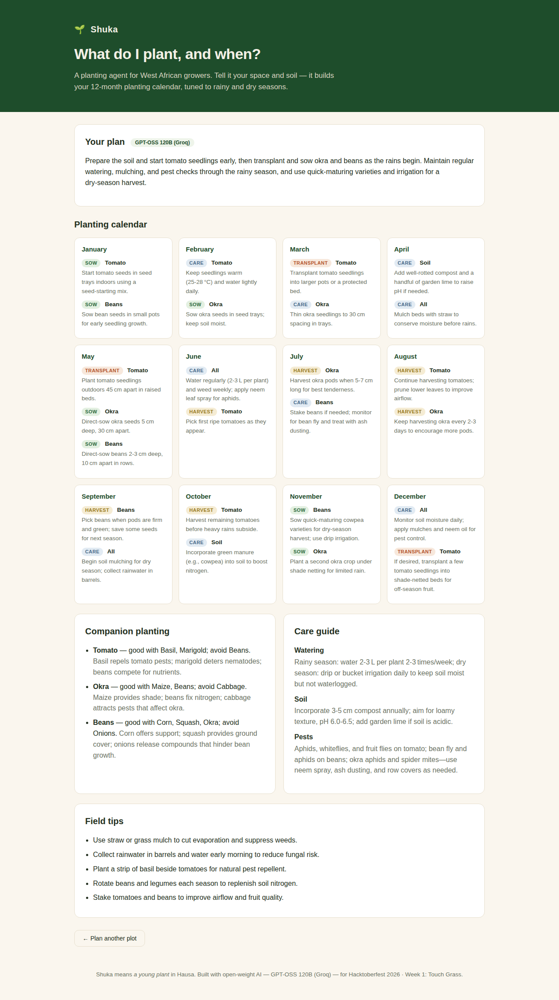

# Shuka, a West African planting agent
# Hausa for a young plant / seedling.



## What it is
Shuka is a planting agent for West African growers. Tell it your space, sunlight,
soil, and what you'd like to grow (or let it surprise you), and it builds you a
12-month planting calendar tuned to the West African rainy and dry seasons:
what to sow, when to transplant, when to harvest, plus companion planting and
care guidance.


[Watch the demo video](demo/shuka-demo.mp4)

Built for Hacktoberfest 2026, Week 1: "Touch Grass". Open-source AI at its core:
an open-weight model (GPT-OSS 120B via Groq)
does the agronomy reasoning. No GPU needed, free inference.

## Run it
```bash
npm install
cp .env.example .env   # then put your keys in .env
npm start
```
Open http://localhost:3000

## Environment
| Variable | Required | Default | What |
|---|---|---|---|
| `PORT` | no | `3000` | Port to listen on |
| `GROQ_API_KEY` | yes | (none) | Free key from console.groq.com |
| `GROQ_MODEL` | no | `openai/gpt-oss-120b` | Any open-weight model on Groq |

`GROQ_API_KEY` is required.

## API
- `GET /api/models` → `{ models: [{ id, label, model, provider }] }`
- `POST /api/plan` → body: `{ location, space, plotSize?, sunlight, soil, crops[], modelId? }`
  → `{ plan: { summary, calendar[12], companions[], care{}, tips[] }, model }`

## Deploy
One service: `npm install` then `node server.js`. Set env vars on your host.

Vercel (free): import the repo, add `GROQ_API_KEY` as an environment variable,
deploy. `public/` is served as static files, `api/models.js` and `api/plan.js`
run as serverless functions (shared core in `lib/shuka.js`).

## License
MIT
